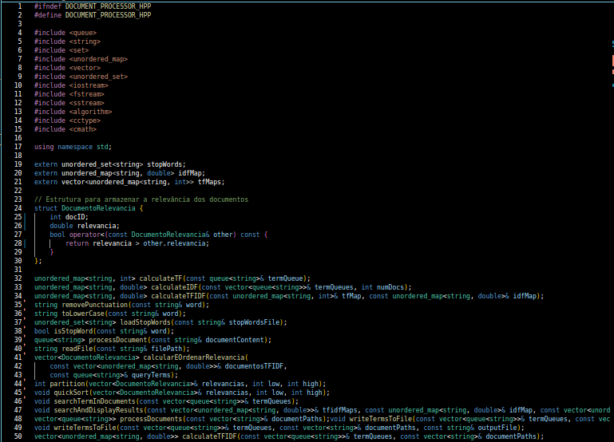
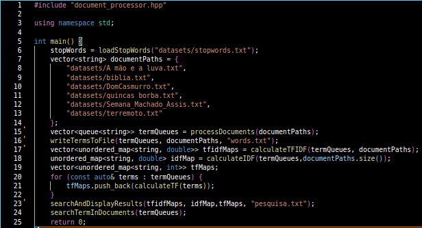
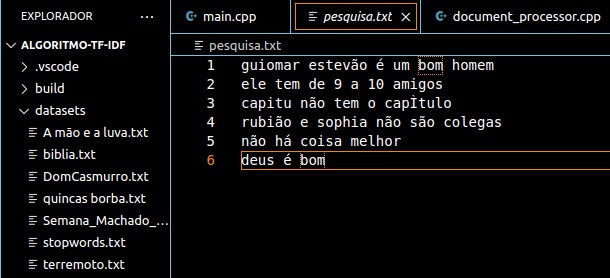
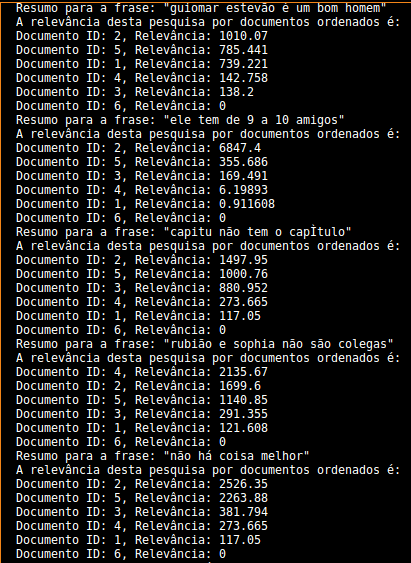
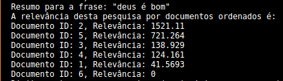

<div align="center">
   
# Processamento de Texto e Extração de Palavras Relevantes usando TF-IDF ⚙️

</div>

## Introdução 📝
<div align="center">
   


</div>

Este projeto tem como objetivo processar documentos de texto para normalizar os termos, remover stopwords e calcular a relevância de cada palavra em relação ao documento, utilizando o algoritmo TF-IDF (Term Frequency - Inverse Document Frequency). O TF-IDF é uma técnica amplamente utilizada em mineração de texto e recuperação de informação, capaz de destacar os termos mais significativos de um conjunto de documentos.

O algoritmo TF-IDF funciona em duas etapas principais:

1. **TF (Frequência de Termos)**: Mede a frequência de uma palavra em um documento específico. Isso reflete a importância do termo no documento em questão.
2. **IDF (Frequência Inversa de Documentos)**: Mede a raridade de uma palavra em um conjunto de documentos. Termos que aparecem em muitos documentos têm menos valor do que aqueles que aparecem em poucos.

Ao combinar essas duas métricas, o TF-IDF ajuda a identificar palavras que são frequentes em um documento, mas raras em outros, destacando-as como mais relevantes.

O projeto inclui a implementação de um sistema que faz a leitura de arquivos de texto, remove a pontuação, normaliza o texto para minúsculas e remove palavras irrelevantes usando uma lista de stopwords. Após o pré-processamento, o sistema é capaz de calcular os valores TF-IDF para cada termo, oferecendo uma visão clara dos termos mais relevantes em cada documento.

---

## Objetivos 🎯
O objetivo deste trabalho é desenvolver um sistema de ranqueamento de documentos utilizando o algoritmo TF/IDF (Term Frequency-Inverse Document Frequency). Os objetivos específicos incluem:

1. **Implementação do Algoritmo TF/IDF**: Construir um sistema que calcule a relevância de documentos em relação a uma consulta de pesquisa, aplicando o algoritmo TF/IDF para ranquear os documentos de forma eficaz.

2. **Exercício de Conceitos Fundamentais**: Reforçar o conhecimento em conceitos abordados na disciplina de Algoritmos e Estruturas de Dados I, incluindo:
   - Análise assintótica para avaliar a eficiência do algoritmo.
   - Uso de listas, pilhas, filas, e tabelas hash para armazenamento e manipulação de dados.
   - Aplicação de métodos de ordenação, como QuickSort, para organizar os documentos com base em sua relevância.

3. **Preparação para Estruturas Avançadas**: Preparar os alunos para o estudo de estruturas de dados mais complexas que serão introduzidas no decorrer do curso, como árvores e grafos. Isso inclui:
   - Analisar como a implementação de estruturas em árvore, como Árvores Binárias de Busca (BST) ou Árvores AVL, pode otimizar a busca e a inserção de termos, reduzindo a complexidade de O(n) para O(log n).
   - Compreender a aplicação de grafos na relação entre documentos e termos de pesquisa, considerando os documentos como vértices e os termos como arestas que conectam os documentos com base em sua relevância.

4. **Desenvolvimento de Habilidades Práticas**: Proporcionar uma oportunidade para os alunos aplicarem teorias de algoritmos e estruturas de dados em um projeto prático, promovendo um entendimento mais profundo sobre o funcionamento e a eficiência das diferentes estruturas de dados em aplicações reais.

Esses objetivos visam não apenas o cumprimento das exigências do trabalho, mas também um aprendizado significativo que prepara os alunos para desafios futuros na área de Ciência da Computação.
  
---

## Estruturas de Dados Escolhidas 🛠️

Neste projeto, foram escolhidas as seguintes estruturas de dados:

- **Tabelas Hash**: Utilizadas para armazenar os termos extraídos dos documentos e suas frequências. As tabelas hash oferecem operações de inserção e busca com complexidade O(1) em média, tornando-as adequadas para o armazenamento rápido de termos e a consulta de frequências.

- **Filas**: As filas foram utilizadas para armazenar os termos de cada documento durante o processamento. Elas permitem a inserção e remoção de elementos de forma eficiente, com complexidade O(1). No entanto, o acesso direto a elementos intermediários não é possível.

### Comparação com Alternativas

- **Listas**: Embora as listas possam ser utilizadas para armazenar termos, elas apresentam complexidade O(n) para operações de busca e inserção, o que pode ser ineficiente em grandes conjuntos de dados. A escolha de tabelas hash, portanto, justifica-se pela eficiência.

- **Árvores**: Estruturas de árvores (como BST ou AVL) poderiam ser consideradas, especialmente para manter a ordem dos termos e permitir buscas eficientes. No entanto, para o propósito específico de armazenamento de termos e cálculo de TF-IDF, as tabelas hash se mostraram mais adequadas devido à simplicidade e rapidez das operações.

## Operações Implementadas e suas Análises Assintóticas 📈

As principais operações implementadas no sistema incluem:

1. **Carregar Stopwords**:
   - **Descrição**: Lê um arquivo de stopwords e armazena os termos em uma tabela hash.
   - **Complexidade**: O(n), onde n é o número de stopwords.

2. **Processar Documentos**:
   - **Descrição**: Lê documentos e extrai termos, armazenando-os em filas.
   - **Complexidade**: O(m), onde m é o número total de palavras nos documentos.

3. **Calcular TF-IDF**:
   - **Descrição**: Calcula o valor TF-IDF para cada termo em cada documento.
   - **Complexidade**: O(d * t), onde d é o número de documentos e t é o número de termos.

4. **Pesquisar Resultados**:
   - **Descrição**: Lê frases de pesquisa e compara com os documentos, exibindo resultados ordenados.
   - **Complexidade**: O(d log d) para a ordenação dos resultados.

---

## Descrição do Código 📖 

Este código é uma implementação de um processador de documentos que realiza a análise de texto para calcular a relevância de documentos com base em consultas de pesquisa. Ele utiliza as técnicas de **Term Frequency (TF)**, **Inverse Document Frequency (IDF)** e **TF-IDF** para classificar documentos de acordo com sua relevância em relação a termos de consulta. Aqui está um resumo das principais funções e sua lógica:

1. **Estruturas de Dados**:
   - `unordered_set<string> stopWords`: Armazena palavras de parada que são ignoradas durante a análise.
   - `unordered_map<string, double> idfMap`: Mapa que associa termos com seus valores de IDF.
   - `vector<unordered_map<string, int>> tfMaps`: Vetor que contém mapas de frequência de termos (TF) para múltiplos documentos.

2. **Funções de Manipulação de Texto**:
   - `removePunctuation`: Remove a pontuação de uma palavra.
   - `toLowerCase`: Converte uma palavra para letras minúsculas.
   - `loadStopWords`: Carrega palavras de parada de um arquivo para o conjunto `stopWords`.

3. **Processamento de Documentos**:
   - `processDocument`: Processa o conteúdo de um documento, removendo pontuação e convertendo palavras para minúsculas. As palavras que não são palavras de parada são adicionadas a uma fila (`queue<string>`).
   - `readFile`: Lê o conteúdo de um arquivo e retorna como uma string.

4. **Cálculo de Frequências**:
   - `calculateTF`: Calcula a frequência de termos (TF) a partir de uma fila de termos, retornando um mapa onde as chaves são os termos e os valores são suas frequências.
   - `calculateIDF`: Calcula o IDF para cada termo, baseado na frequência de documentos que contêm esse termo. Retorna um mapa de termos para seus valores de IDF.

5. **Cálculo de TF-IDF**:
   - `calculateTFIDF`: Combina os mapas de TF e IDF para calcular os valores de TF-IDF, retornando um mapa que relaciona termos com seus valores de TF-IDF.

6. **Relevância de Documentos**:
   - `calcularRelevancia`: Calcula a relevância de um documento em relação a uma consulta, somando os valores de TF-IDF dos termos da consulta que estão presentes no documento.
   - `calcularEOrdenarRelevancia`: Calcula e ordena a relevância de múltiplos documentos com base em suas pontuações de TF-IDF em relação aos termos de consulta.

7. **Ordenação**:
   - `partition` e `quickSort`: Implementações do algoritmo QuickSort para ordenar a relevância dos documentos de forma decrescente.

8. **Processamento de Múltiplos Documentos**:
   - `processDocuments`: Lê múltiplos documentos a partir de um vetor de caminhos de arquivos, processando cada um para extrair termos e armazená-los em filas.

9. **Saída de Resultados**:
   - `writeTermsToFile`: Escreve os termos normalizados de cada documento em um arquivo de saída.
   - `searchAndDisplayResults`: Realiza a pesquisa por termos de consulta, calcula a relevância de cada documento e salva os resultados em um arquivo. Para cada consulta, exibe detalhes como TF, IDF, e TF-IDF para os termos, além das cinco palavras mais relevantes de cada documento.

### Funcionamento Geral 

1. **Inicialização**: As stop words são carregadas de um arquivo.
2. **Leitura de Documentos**: O código lê os documentos de um conjunto de caminhos fornecidos e processa cada um para normalizar e extrair termos relevantes.
3. **Cálculo de TF e IDF**: A frequência dos termos é calculada e, em seguida, o IDF é computado para cada termo. O TF-IDF é então calculado para cada documento.
4. **Relevância**: Quando uma consulta é fornecida, o código calcula a relevância de cada documento com base nos termos da consulta e suas pontuações de TF-IDF.
5. **Ordenação e Saída**: Os resultados são ordenados e salvos em um arquivo, juntamente com detalhes sobre a frequência dos termos e a relevância dos documentos em relação à consulta.

Segue abaixo imagens do arquivo `document_processor.hpp` e `main.cpp`:

<div align="center">
   




</div>


---

## Dificuldades de Implementação 🔍

Ao implementar o algoritmo de ranqueamento de documentos, algumas dificuldades podem ser encontradas:

1. **Gerenciamento de Stopwords**: 
   A correta identificação e carregamento das stopwords pode ser desafiador, especialmente se o arquivo de stopwords não estiver no formato esperado. Um arquivo mal formatado pode causar falhas na leitura e no processamento, resultando em erros que afetam a relevância dos termos extraídos. Para mitigar isso, a implementação de uma estrutura de dados mais robusta, como uma árvore, poderia ajudar na organização e na rápida verificação da existência de stopwords.

2. **Processamento de Documentos**: 
   O tratamento de diferentes formatos de documentos, como PDFs ou arquivos de texto com codificações distintas, pode exigir adaptações no código. Isso pode ser complicado devido à variedade de bibliotecas necessárias para ler cada formato. Uma abordagem que utilize grafos poderia representar documentos como vértices e suas relações como arestas, facilitando a manipulação e a conversão entre diferentes formatos. Além disso, a utilização de uma estrutura de árvore poderia organizar os termos de cada documento hierarquicamente, facilitando o acesso e a busca.

3. **Cálculo de TF-IDF**: 
   A implementação eficiente do cálculo de TF-IDF em grandes conjuntos de dados pode resultar em um consumo elevado de memória e tempo de processamento. A utilização de tabelas hash para armazenar termos e seus respectivos contadores é uma abordagem comum, mas pode ser otimizada. Estruturas de árvore, como Árvores AVL, poderiam ser utilizadas para manter os termos em uma ordem balanceada, permitindo inserções e buscas com complexidade O(log n). Isso não só melhoraria a eficiência do cálculo como também reduziria o uso de memória em comparação com uma lista desordenada.

4. **Ordenação de Resultados**: 
   A ordenação dos documentos com base em sua relevância pode ser complexa se não houver uma estrutura de dados adequada. Métodos tradicionais de ordenação, como QuickSort, têm uma complexidade O(n log n), que é aceitável, mas a implementação de uma estrutura de dados como uma árvore binária de busca (BST) ou uma árvore balanceada (como AVL) poderia facilitar a inserção dos documentos de maneira ordenada à medida que são processados. Isso não apenas reduziria o custo de ordenação, mas também permitiria consultas mais rápidas para determinar a relevância de novos documentos à medida que eles são adicionados ao sistema.

### Considerações sobre Estruturas de Dados

A utilização de estruturas de árvore e grafo poderia melhorar significativamente a eficiência e a escalabilidade do sistema de ranqueamento de documentos. Enquanto as estruturas de dados básicas, como listas e tabelas hash, fornecem uma base funcional, elas apresentam limitações em cenários de grandes volumes de dados e operações complexas. Estruturas mais avançadas permitem não apenas a organização eficiente dos dados, mas também uma implementação mais intuitiva dos algoritmos de busca e ranqueamento, preparando o terreno para a exploração de conceitos mais avançados, como aprendizado de máquina e análise de redes.

---

## Resumo dos Resultados 📊 

Para cada frase de pesquisa, o algoritmo gera um resumo contendo os documentos ordenados por relevância e a frase correspondente. O seguinte exemplo ilustra o formato dos resultados:

```
Resumo para a frase: "exemplo de frase de busca"
A relevância desta pesquisa por documentos ordenados é:
Documento ID: 3, Relevância: 0.785
Documento ID: 5, Relevância: 0.654
Documento ID: 1, Relevância: 0.432
```

Nesse formato, a frase pesquisada é exibida junto com os IDs dos documentos e suas respectivas relevâncias, facilitando a análise da relevância dos documentos para cada consulta. A imagem abaixo mostra as frases selecionadas baseadas nas palavras com maior relevância de cada documento.

<div align="center">
   


</div>

Os resultados obtidos respectivamente desta entrada de frases foi:

<div align="center">
   




</div>

Ao aplicar o algoritmo **TF-IDF** a documentos tão distintos como os **livros de Machado de Assis**, a **Bíblia**, e um **livro sobre terremotos**, o resultado reflete as diferenças entre os conteúdos com base na frequência e relevância das palavras em cada contexto.

- **TF (Term Frequency)** mede a frequência de uma palavra em um documento. Em um livro de Machado de Assis, termos literários e filosóficos aparecem frequentemente. Na Bíblia, termos religiosos, como "fé" e "Deus", são muito recorrentes, enquanto em um livro sobre terremotos, termos técnicos como "falha", "placa tectônica" e "sismologia" são dominantes.
  
- **IDF (Inverse Document Frequency)** diminui o peso de palavras comuns que aparecem em todos os documentos, como "o", "de", "e". Palavras específicas a cada tipo de texto terão maior peso na relevância. Por exemplo, "ressurreição" terá alta relevância na Bíblia, mas não em um livro científico.

Quando o TF-IDF é aplicado, as palavras que melhor diferenciam os documentos são aquelas mais raras em uma coleção global, mas frequentes em um único texto. Assim, o algoritmo destaca o quão únicos os termos são para cada tipo de documento.

## Conclusão ✅

O desenvolvimento deste projeto, que envolveu a implementação de um código em C++ utilizando as técnicas de TF-IDF e Quick Sort, proporcionou uma experiência enriquecedora no campo da análise textual e recuperação de informações. O objetivo principal foi avaliar a relevância de frases extraídas de textos significativos, como a Bíblia e obras de Machado de Assis, utilizando uma abordagem quantitativa e sistemática.

A técnica de TF-IDF foi essencial para medir a importância relativa de termos em relação a documentos distintos, permitindo que o sistema destacasse palavras-chave e frases que possuíam maior relevância para o contexto dos textos analisados. Essa métrica se mostrou particularmente eficaz em identificar as nuances presentes nas obras literárias, contribuindo para uma compreensão mais profunda das intenções dos autores e dos temas abordados.

Além disso, a utilização do algoritmo Quick Sort permitiu uma ordenação eficiente das frases com base nas suas pontuações de relevância, facilitando a apresentação dos resultados de forma clara e acessível. A combinação dessa técnica com estruturas de dados, como tabelas hash e listas, otimizou o armazenamento e a recuperação de palavras e termos, garantindo uma manipulação ágil e eficaz dos dados durante todo o processo.

Os resultados obtidos evidenciaram a capacidade do sistema em identificar frases relevantes de maneira precisa e rápida, destacando a importância das escolhas estruturais e algorítmicas no sucesso do projeto. O uso de tabelas hash proporcionou um acesso eficiente às informações, enquanto as listas possibilitaram uma organização flexível dos dados analisados.

Este trabalho não apenas demonstrou a aplicação prática de conceitos de ciência da computação, como análise de dados e algoritmos de ordenação, mas também destacou a relevância da literatura na formação de um repertório cultural mais rico. A integração de métodos computacionais com textos clássicos ilustra o potencial da tecnologia na exploração e apreciação da literatura, abrindo portas para futuras pesquisas e aplicações na área de processamento de linguagem natural.

---
 
## Compilação e Execução

 Especificações da máquina em que o código foi rodado:
  * Processador Intel Celeron N4020;
  * Sistema Operacional Ubuntu 22.04.01;
  * 4 GB de RAM.
* | Comando                |  Função                                                                                           |                     
  | -----------------------| ------------------------------------------------------------------------------------------------- |
  |  `make clean`          | Apaga a última compilação realizada contida na pasta build.                                       |
  |  `make`                | Executa a compilação do programa utilizando o g++, e o resultado vai para a pasta build.          |
  |  `make run`            | Executa o programa da pasta build após a realização da compilação.                                |

---

## Integrantes:

**João Pedro Rodrigues Silva**  
[](https://github.com/Jottynha)
[](mailto:jprs1308@gmail.com)

**Pedro Augusto Moura**  
[](https://github.com/PedroAugusto08)
[](mailto:pedroaugustomoura70927@gmail.com)

**Henrique de Freitas Araujo**  
[
](https://github.com/Ak4ai)
[](mailto:ricosgames.henrique@gmail.com )

___


<!---
✉️ jprs1308@gmail.com (**João Pedro Rodrigues Silva**)

✉️ pedroaugustomoura70927@gmail.com (**Pedro Augusto Moura**)

✉️ ricosgames.henrique@gmail.com (**Henrique de Freitas Araujo**)

--->
